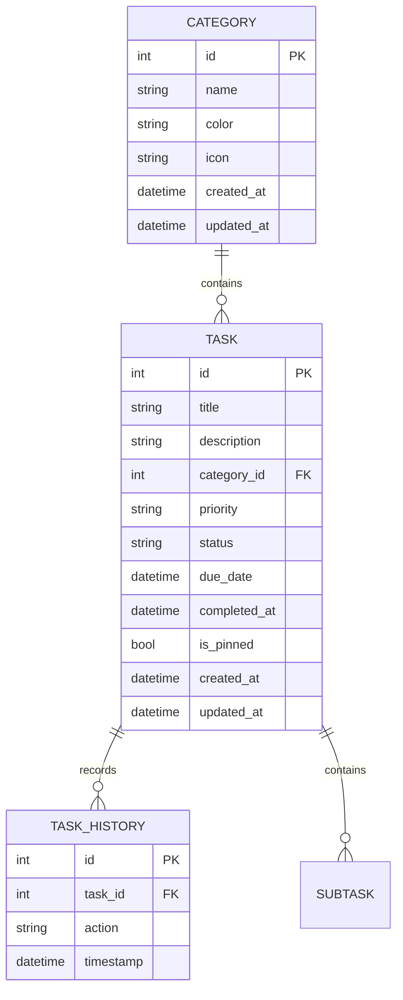

# Database Schema Specification

**Project:** Perductivity (Working Title)  
**Version:** 1.0.0  
**Status:** Required

---

# Purpose

This document defines the database architecture, schema, relationships, constraints, and migration strategy for the application.

This is the single source of truth for all persistent data.

Every database modification must update this document.

---

# Database Goals

The database must be:

- Offline First
- Fast
- Lightweight
- Scalable
- Easy to migrate
- Easy to maintain
- AI-ready
- Cloud-sync ready

---

# Database Technology

## Current

Drift (SQLite)

Reasons

- Fully offline
- Strong typing
- Migration support
- Relational database
- Excellent Flutter support
- Free & Open Source

---

## Future

Support synchronization with:

- Supabase Free
- Firebase Spark
- Appwrite
- PocketBase

without changing the application architecture.

---

# Database Structure

```text
Category
    │
    │ 1
    │
    │
    └───────────────∞
                    │
                    │
                  Task
                    │
                    │
                    └──────────────∞
                                   │
                                   │
                              TaskHistory
```

---

# Tables

Current MVP

- categories
- tasks
- subtasks
- task_history

New installations and schema upgrades create one default `Personal` category
so users can create their first task without completing a separate setup flow.

Future

- reminders
- recurring_tasks
- tags
- task_tags
- attachments
- settings
- sync_queue

---

# Categories Table

Stores task categories.

## Fields

| Field      | Type     | Required | Description        |
| ---------- | -------- | -------- | ------------------ |
| id         | INTEGER  | Yes      | Primary Key        |
| name       | TEXT     | Yes      | Category Name      |
| color      | TEXT     | Yes      | Hex Color          |
| icon       | TEXT     | Yes      | Material Icon Name |
| created_at | DATETIME | Yes      | Created Date       |
| updated_at | DATETIME | Yes      | Last Modified      |

---

## Constraints

- Category name must be unique.
- Name cannot be empty.
- Color must be valid HEX.
- Icon cannot be null.

---

## Example

```json
{
  "id": 1,
  "name": "University",
  "color": "#2563EB",
  "icon": "school"
}
```

---

# Tasks Table

Stores all user tasks.

## Fields

| Field        | Type     | Required | Description     |
| ------------ | -------- | -------- | --------------- |
| id           | INTEGER  | Yes      | Primary Key     |
| title        | TEXT     | Yes      | Task title      |
| description  | TEXT     | No       | Task details    |
| category_id  | INTEGER  | Yes      | FK Categories   |
| priority     | TEXT     | Yes      | Enum            |
| status       | TEXT     | Yes      | Enum            |
| due_date     | DATETIME | No       | Due Date        |
| completed_at | DATETIME | No       | Completion Time |
| recurrence   | TEXT     | Yes      | Repeat Rule     |
| is_pinned    | BOOLEAN  | Yes      | Pin Task        |
| created_at   | DATETIME | Yes      | Created         |
| updated_at   | DATETIME | Yes      | Updated         |

---

## Constraints

- Title required.
- Title length <= 150.
- Description <= 5000.
- Priority must be valid enum.
- Status must be valid enum.
- Recurrence must be valid rule.
- Foreign key required.

---

## Example

```json
{
  "id": 5,
  "title": "Finish Flutter Assignment",
  "description": "Complete UI implementation",
  "category_id": 2,
  "priority": "high",
  "status": "todo",
  "due_date": "2026-08-10T10:00:00"
}
```

---

# Subtasks Table

Stores smaller steps belonging to a task.

## Fields

| Field        | Type     | Required | Description      |
| ------------ | -------- | -------- | ---------------- |
| id           | INTEGER  | Yes      | Primary Key      |
| task_id      | INTEGER  | Yes      | FK Tasks         |
| title        | TEXT     | Yes      | Step description |
| is_completed | BOOLEAN  | Yes      | Completion state |
| created_at   | DATETIME | Yes      | Created          |
| updated_at   | DATETIME | Yes      | Updated          |

---

# Task History Table

Tracks important task events.

Examples

- Created
- Updated
- Completed
- Deleted
- Restored

---

## Fields

| Field     | Type     |
| --------- | -------- |
| id        | INTEGER  |
| task_id   | INTEGER  |
| action    | TEXT     |
| timestamp | DATETIME |

---

## Example

```json
{
  "task_id": 3,
  "action": "completed",
  "timestamp": "2026-08-02T13:40:00"
}
```

---

# Enums

## Priority

```text
low
medium
high
```

---

## Status

```text
todo
in_progress
completed
archived
```

---

## Recurrence

```text
none
daily
weekly
monthly
```

---

# Relationships

## Categories

```text
Category

1

↓

∞

Task
```

---

## Tasks

```text
Task

1

↓

∞

TaskHistory
```

---

## Subtasks

```text
Task

1

↓

∞

Subtask
```

---

# ER Diagram



---

# Indexes

Create indexes for:

Tasks

- status
- priority
- due_date
- category_id

Categories

- name

Task History

- task_id
- timestamp

---

# Cascade Rules

Deleting a category

NOT allowed while tasks exist.

Application should request:

- Move Tasks
- Delete Tasks
- Cancel

Deleting a task

Does NOT delete history.

---

# Validation Rules

Task

Title

- Required
- Max 150

Description

- Max 5000

Category

- Required

Priority

- Enum only

Status

- Enum only

---

# Soft Delete Policy

MVP

No soft delete.

Deleted records are permanently removed.

Future

Add:

```text
deleted_at
```

for cloud synchronization.

---

# Time Handling

All timestamps stored as:

UTC

Displayed using

Local Timezone

---

# ID Strategy

Primary Keys

INTEGER AUTOINCREMENT

Future cloud sync

UUID support.

---

# Database Versioning

Current

Version 1

---

Future versions

Version 2

Recurring Tasks

Version 3

Notifications

Version 4

Tags

Version 5

Attachments

Version 6

Cloud Sync

---

# Migration Strategy

Every schema modification requires:

1. Increment database version.
2. Create migration.
3. Preserve user data.
4. Update SCHEMA.md.
5. Test migration.

Never delete production data.

---

# Backup Strategy

Current

Local SQLite database.

Future

- Export JSON
- Import JSON
- Cloud Backup

---

# Performance Goals

Task lookup

<100ms

Task creation

<50ms

Category lookup

<20ms

Database startup

<100ms

---

# Security

Never store:

- Passwords
- Tokens
- API Keys

Sensitive information should use:

Flutter Secure Storage

---

# Future Tables

Reserved

```text
settings

notifications

reminders

attachments

tags

task_tags

recurring_tasks

sync_queue

users

workspaces

projects
```

These tables are intentionally excluded from MVP.

---

# Data Ownership

Each feature owns its own data.

Tasks Feature

- tasks
- task_history

Categories Feature

- categories

Future features own their own tables.

Avoid sharing ownership between features.

---

# Repository Mapping

```text
TaskRepository

↓

tasks
task_history

CategoryRepository

↓

categories
```

Repositories are the only layer allowed to access data sources.

---

# Naming Convention

Tables

snake_case

Columns

snake_case

Enums

lowercase

Foreign Keys

table_id

Example

```text
category_id
task_id
```

---

# Schema Rules

Always

- Normalize data.
- Use foreign keys.
- Use indexes where needed.
- Use UTC timestamps.
- Validate before insertion.
- Keep migrations backward compatible.

Never

- Duplicate data.
- Store computed values unnecessarily.
- Use dynamic schemas.
- Break foreign key relationships.
- Modify schema without a migration.
- Access tables directly from UI.

---

# Definition of Done

A schema update is complete only if:

- Tables are documented.
- Relationships are updated.
- Migrations are written.
- Constraints are validated.
- Indexes are reviewed.
- Repositories updated.
- Documentation updated.
- Tests pass.

---

# Schema Authority

This document is the authoritative reference for all persistent data.

No database changes may be implemented without updating this document first.
